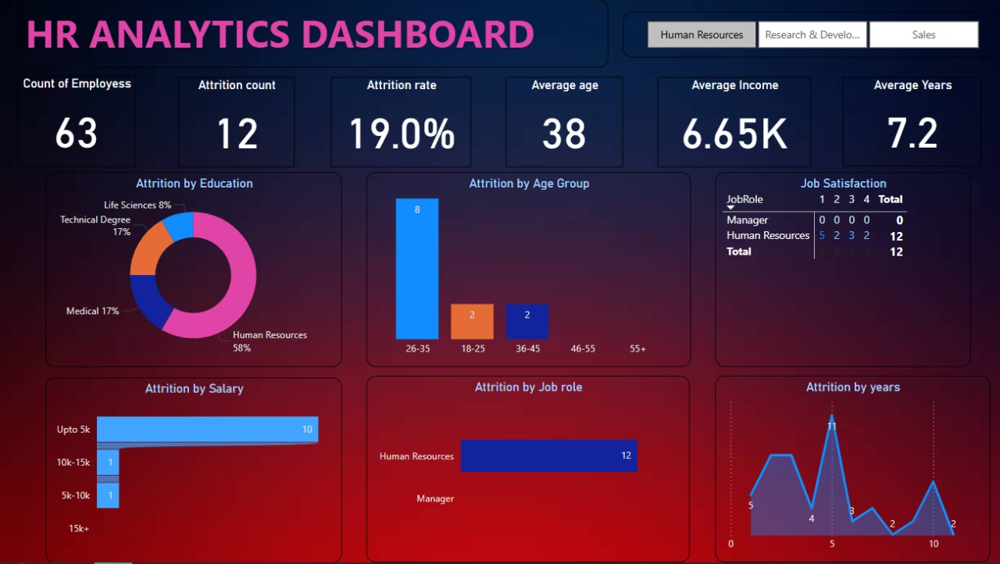
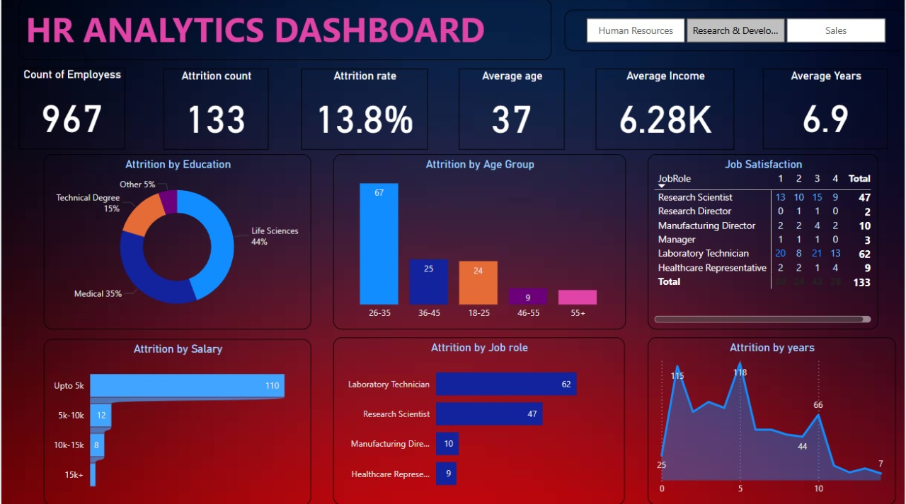
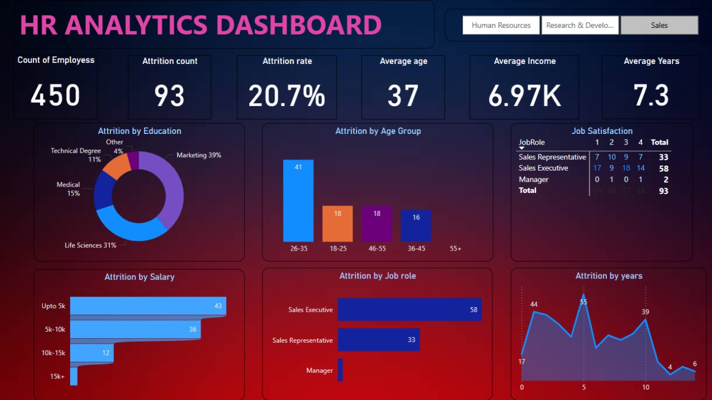

# 📊 HR Analytics Dashboard - Power BI Project

A Power BI dashboard analyzing employee attrition trends across HR, Research & Development, and Sales departments.

---

## 📌 Key Insights
- **Overall Attrition Rate:** 13.8%  
- **Top Affected Roles:** Laboratory Technician, Research Scientist  
- **High-Risk Groups:** Employees aged 26–35, low salary (<$5k)  
- **Department Breakdown:**  
  - **Research & Development:** Highest attrition in Life Sciences roles  
  - **Sales:** Linked to overtime and job satisfaction  

---

## 🖼️ Dashboard Views
| Department              | Screenshot                      |
|-------------------------|---------------------------------|
| **HR Overview**         |     |
| **Research & Development** |  |
| **Sales**               |  |

---

## 🛠️ Tools Used
- **Power BI Desktop** (DAX, measures, custom visuals)  
- **Data Source:** `HR_Analytics.csv`  
- **Visualizations:** Bar charts, pie charts, slicers, KPIs  

---

## 📂 Files in This Repository

---

## 🚀 How to Use
1. **For Analysis:**  
   - Download `HR_Dashboard.pbix` and open in Power BI Desktop  
2. **Quick Preview:**  
   - View screenshots in `images/` folder  

---

## 📜 Author
© 2024 Jayesh Ambaldhage  
*GitHub Repository for Portfolio*